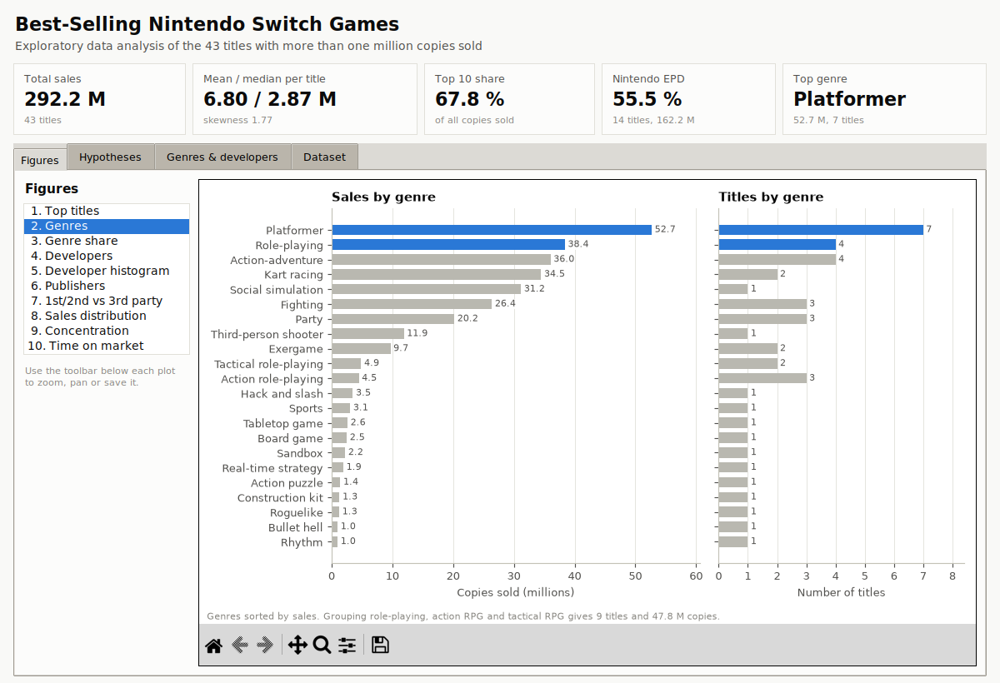
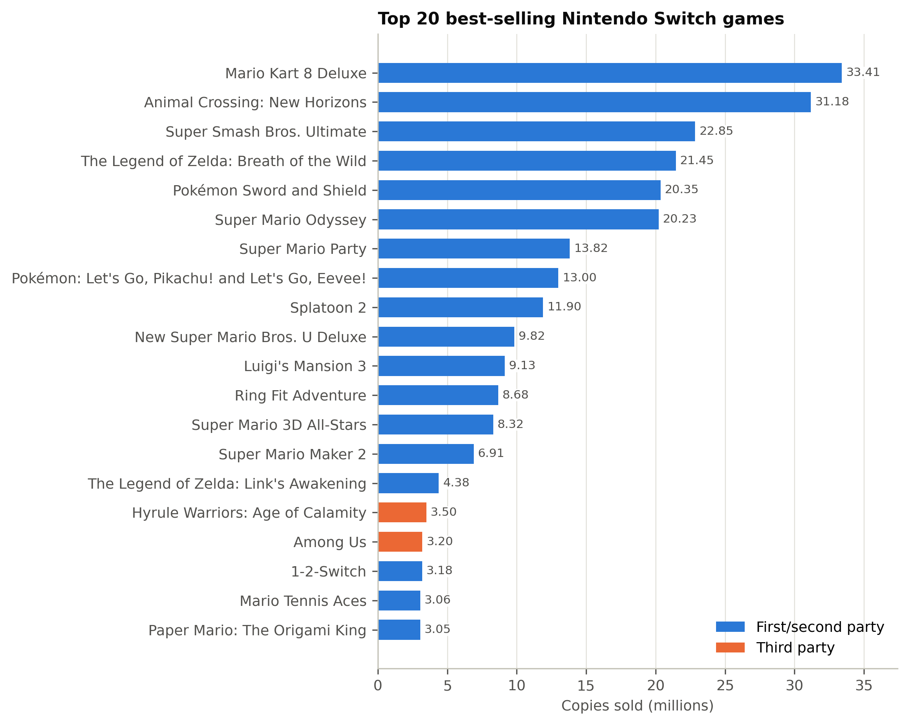
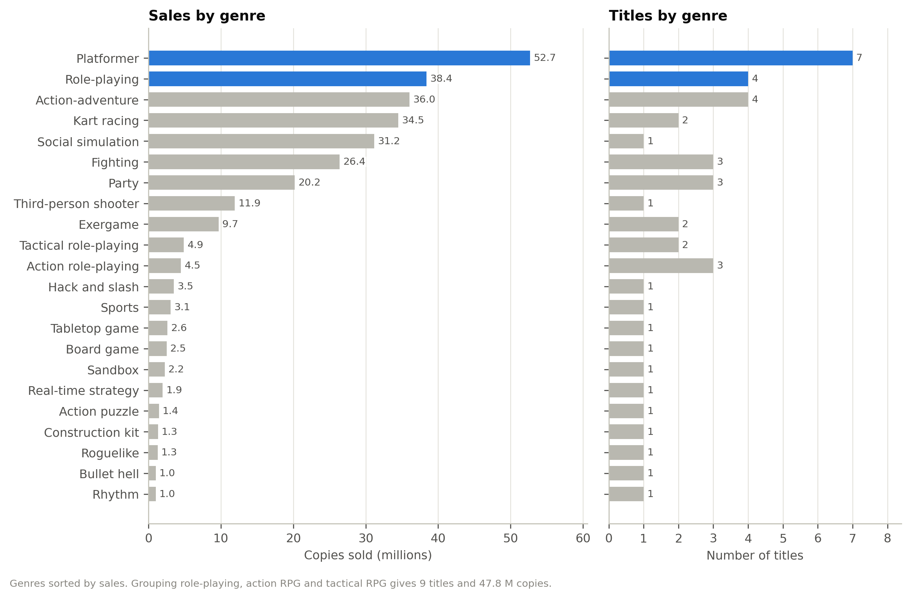
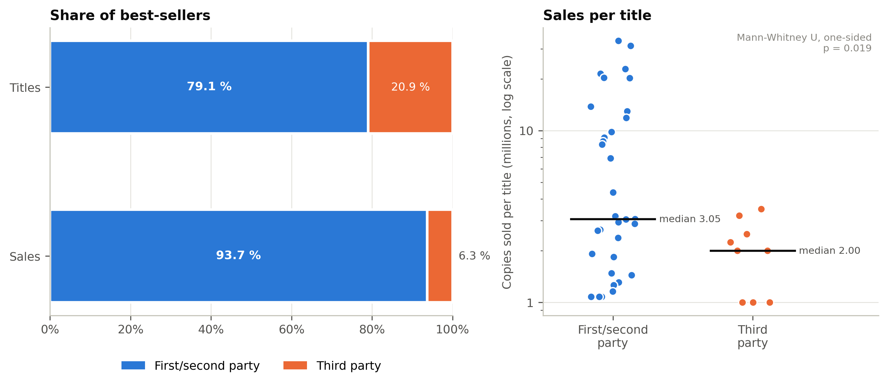
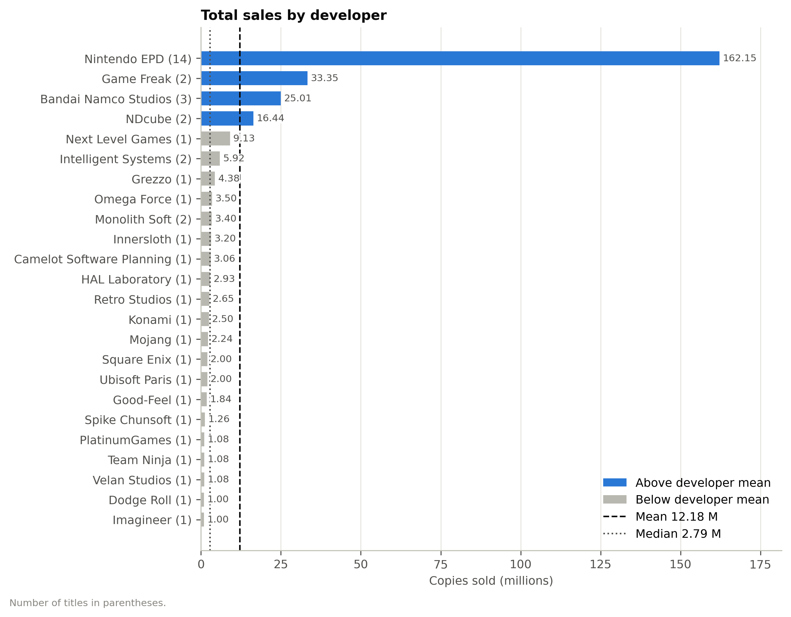
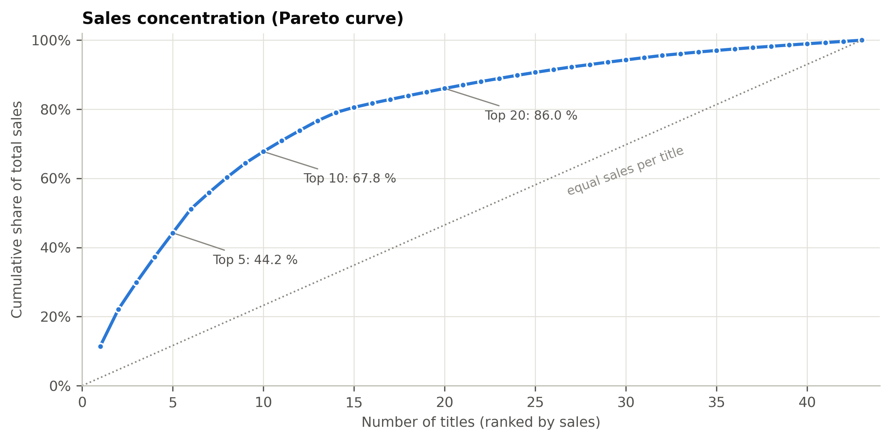
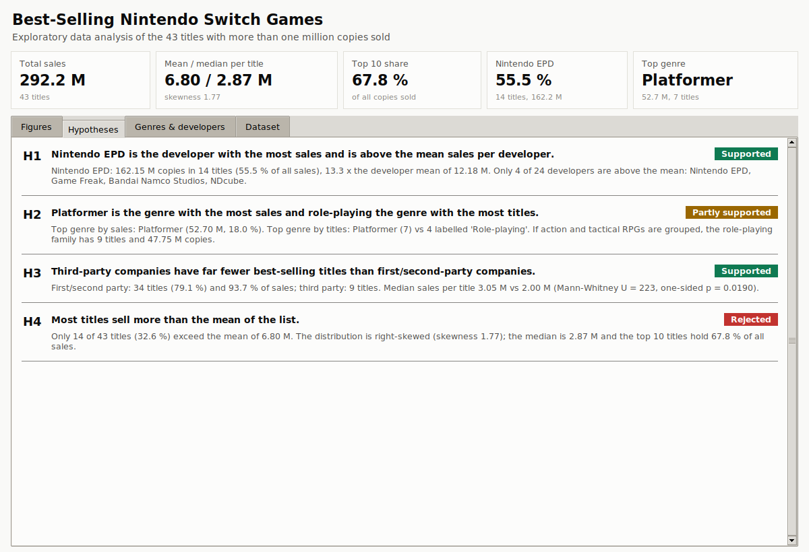
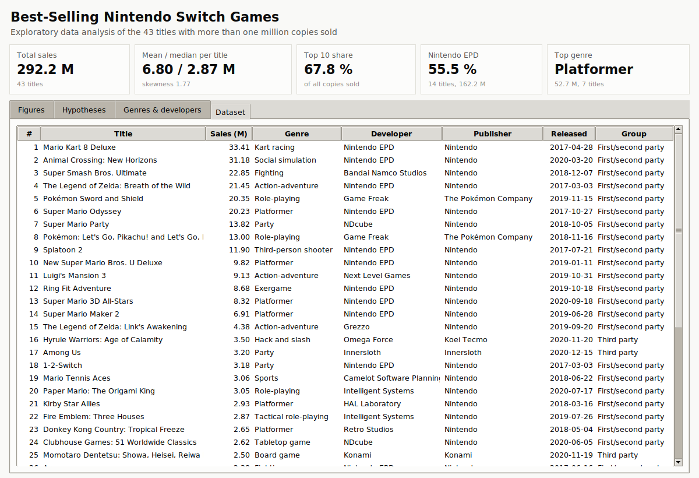

# Best-Selling Nintendo Switch Games: Exploratory Data Analysis

Python data analysis of the **43 Nintendo Switch games with more than one million copies sold** (292.2 million copies in total). The project cleans the data, groups sales by genre, developer and publisher, and tests four market hypotheses. When you run it, a desktop window opens with all the results and interactive figures.

Final project for **Programming Fundamentals** (2022-1), Universidad EAFIT (Medellín, Colombia). The code and the report were rewritten in English and improved (see [what changed](#improvements-over-the-original-deliverable)).

📄 **[Read the IEEE-format report (PDF)](03_Report/IEEE_Report.pdf)**

### Interactive interface

Running `02_Analysis/switch_sales_analysis.py` opens this window ([how to run it](#run-the-analysis)):



---

## Key findings

| Hypothesis | Result | Evidence |
|---|---|---|
| **H1** Nintendo EPD is the developer with the most sales and is above the developer mean | ✅ Supported | 162.15 M copies in 14 titles (55.5 % of all sales), 13.3 × the developer mean of 12.18 M |
| **H2** Platformer leads sales; role-playing leads the number of titles | ⚠️ Partly supported | Platformer leads both sales (18.0 %) and titles (7). "Role-playing" has 4 titles, but the whole RPG family (RPG + action RPG + tactical RPG) has 9 |
| **H3** Third parties have far fewer best-sellers than first/second parties | ✅ Supported | First/second party: 79.1 % of titles and 93.7 % of sales. Median sales per title are also higher (3.05 M vs 2.00 M, Mann-Whitney p = 0.019) |
| **H4** Most titles sell more than the mean | ❌ Rejected | Only 14 of 43 titles (32.6 %) are above the mean of 6.80 M. The median is 2.87 M, and the top 10 games hold 67.8 % of all sales |



| Sales by genre | First/second party vs third party |
|---|---|
|  |  |

| Sales by developer | Sales concentration |
|---|---|
|  |  |

## Dataset

[Top Selling Switch Games](https://www.kaggle.com/datasets/rushikeshhiray/top-selling-switch-games) (Kaggle, taken from the [Wikipedia list](https://en.wikipedia.org/wiki/List_of_best-selling_Nintendo_Switch_video_games)). It has 43 rows with these columns: title, copies sold (millions), date of the sales figure, release date, genre, developer and publisher.

Limitations:

- Only games above one million copies are listed.
- The sales figures were taken on different dates (2018–2021).
- For seven games, only one regional publisher is kept (for example, `JP: Konami`).

## Run the analysis

### Step by step (Windows + VS Code)

1. **Install Python 3.10 or newer** (skip this if you already have it). Download it from [python.org](https://www.python.org/downloads/) and tick **"Add python.exe to PATH"** during installation. A Python installed with `uv` also works.
2. **Install VS Code** from [code.visualstudio.com](https://code.visualstudio.com/) and add the **Python** extension: open the Extensions panel, search "Python" and click Install.
3. **Get the project.** Clone it with `git clone https://github.com/Senki16/nintendo-switch-sales-analysis.git`, or use **Code → Download ZIP** on GitHub and extract it.
4. **Open the folder** in VS Code: **File → Open Folder…** and select the project folder (the one that contains `README.md`).
5. **Open the script** `02_Analysis/switch_sales_analysis.py`.
6. **Press Run** (the ▶ button in the top-right corner) or **F5**.
7. **First run only:** the script creates a local environment (`.venv`) and installs numpy, pandas, matplotlib and scipy. This takes 1–2 minutes and needs an internet connection. Later runs start immediately.
8. **See the results.** The terminal prints the statistics and the verdict on each hypothesis, and the window opens. Close the window to finish.
9. *(Optional)* To remove the yellow "Import could not be resolved" warnings, press `Ctrl + Shift + P`, run **Python: Select Interpreter** and choose the one marked **.venv**.

**Without VS Code:** double-click `run_analysis.bat`, or run `python 02_Analysis/switch_sales_analysis.py` in a terminal. Add `--no-gui` if you only want the files.

### Interface

- **Top row:** total sales, mean and median per title, top-10 share, Nintendo EPD's share and the top genre.
- **Figures:** pick one of the 10 plots from the list. The toolbar lets you zoom, pan and save each plot.
- **Hypotheses:** each hypothesis with its result (supported / partly supported / rejected) and the numbers behind it.
- **Genres & developers:** the grouped tables.
- **Dataset:** the cleaned data. Click a column header to sort by it.

| Hypotheses tab | Dataset tab |
|---|---|
|  |  |

### What the script produces

- **`02_Analysis/results/`:**
  - `clean_dataset.csv`
  - sales tables by genre, genre family, developer, publisher and publisher group
  - `summary.json`, with all the statistics and the hypothesis results
- **`02_Analysis/figures/`:** 10 PNG figures (300 dpi):
  - top 20 titles
  - genres
  - genre share
  - developers
  - developer histogram
  - publishers
  - first/second party vs third party
  - sales distribution
  - Pareto curve
  - sales vs time on the market

To rebuild the report, run `latexmk -pdf IEEE_Report.tex` inside `03_Report/` (it needs the IEEEtran class).

<details>
<summary><b>Guía en español: cómo ejecutar el análisis</b></summary>

1. **Instala Python 3.10 o superior** (si no lo tienes) desde [python.org](https://www.python.org/downloads/) y marca **"Add python.exe to PATH"** durante la instalación. Un Python instalado con `uv` también sirve.
2. **Instala VS Code** desde [code.visualstudio.com](https://code.visualstudio.com/) y agrega la extensión **Python**: abre el panel de Extensiones, busca "Python" y haz clic en Install.
3. **Descarga el proyecto** con `git clone https://github.com/Senki16/nintendo-switch-sales-analysis.git`, o en GitHub usa **Code → Download ZIP** y descomprímelo.
4. **Abre la carpeta** en VS Code: **File → Open Folder…** y elige la carpeta que tiene el `README.md`.
5. **Abre el archivo** `02_Analysis/switch_sales_analysis.py`.
6. **Dale Run** (el botón ▶ arriba a la derecha) o presiona **F5**.
7. **Solo la primera vez:** el script crea un entorno local (`.venv`) e instala numpy, pandas, matplotlib y scipy. Tarda 1–2 minutos y necesita internet.
8. **Mira los resultados.** La terminal muestra las estadísticas y el veredicto de cada hipótesis, y se abre la ventana. Ciérrala para terminar.
9. *(Opcional)* Para quitar las advertencias amarillas: `Ctrl + Shift + P` → **Python: Select Interpreter** → elige el que diga **.venv**.

**Sin VS Code:** haz doble clic en `run_analysis.bat`, o ejecuta `python 02_Analysis/switch_sales_analysis.py`. Agrega `--no-gui` si solo quieres los archivos.

**En la ventana:**

- **Figures:** elige una de las 10 gráficas en la lista. Con la barra de abajo puedes hacer zoom, moverte y guardar la imagen.
- **Hypotheses:** cada hipótesis con su resultado y los datos que lo respaldan.
- **Genres & developers:** las tablas por género y por desarrolladora.
- **Dataset:** los datos limpios. Haz clic en un encabezado para ordenar por esa columna.

</details>

## Repository structure

```
01_Data/
└── switch_top_selling_games.csv   Kaggle dataset (43 titles)
02_Analysis/
├── switch_sales_analysis.py       Cleaning, statistics, figures and GUI
├── results/                       Generated tables (CSV / JSON)
└── figures/                       Generated plots (PNG)
03_Report/                         IEEE report (LaTeX source + PDF)
04_Images/                         Interface screenshots
05_Original_Submission/            Original Colab notebook, Spanish report and video
run_analysis.bat                   One-click launcher for Windows
requirements.txt
```

## Author

David Zuluaga Henao, Mechanical Engineering, Universidad EAFIT
